# Сети в Linux

1. [Инструмент ipcalc](#part-1-инструмент-ipcalc) \
2. [Статическая маршрутизация между двумя машинами](#part-2-статическая-маршрутизация-между-двумя-машинами) \
3. [Утилита iperf3](#part-3-утилита-iperf3) \
4. [Сетевой экран](#part-4-сетевой-экран) \
5. [Статическая маршрутизация сети](#part-5-статическая-маршрутизация-сети) \
6. [Динамическая настройка IP с помощью DHCP](#part-6-динамическая-настройка-ip-с-помощью-dhcp) \
7. [NAT](#part-7-nat) \

# Part 1. Инструмент ipcalc.

## 1.1. Сети и маски

## Определить и записать в отчёт:

## 1) Адрес сети 192.167.38.54/13

С помощью команды: ipcalc мы узнаем адрес сети

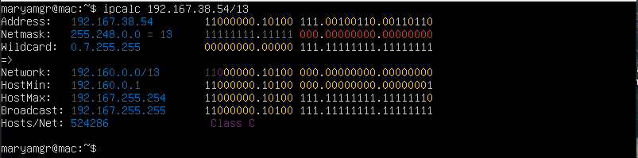

## 2) Перевод маски 255.255.255.0 в префиксную и двоичную запись, /15 в обычную и двоичную, 11111111.11111111.11111111.11110000 в обычную и префиксную

С помощью команды: ipcalc мы также можем перевести в двоичную, обычную и префиксную запись
Префиксная запись маски = 24; двоичная запись = 11111111.11111111.11111111.00000000.

Обычная запись маски /15 = 255.254.0.0; двоичная запись = 11111111.11111110.00000000.00000000.

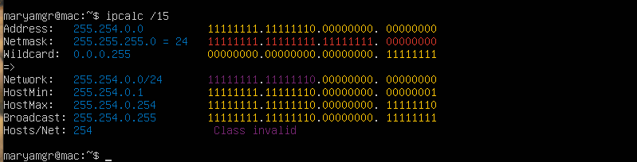

Чтобы перевести в обычную и префиксную запись маску 11111111.11111111.11111111.11110000, то мы должны подсчитать количество единиц(28) и пишем это число вместе с командой ipcalc

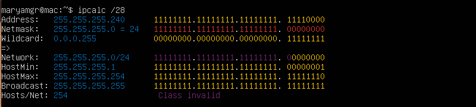

## 3) Минимальный и максимальный хост в сети 12.167.38.4 при масках: /8, 11111111.11111111.00000000.00000000, 255.255.254.0 и /4

Так же с помощью команды: ipcalc мы можем увидеть минимальный и максимальный хост.
12.167.38.4/8:

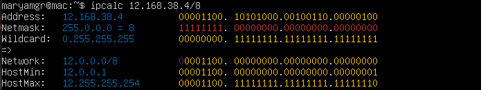

12.167.38.4/16:

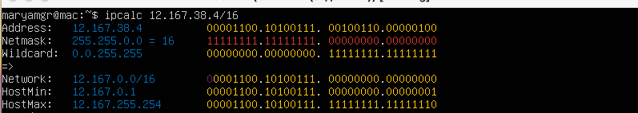

255.255.254.0/4:

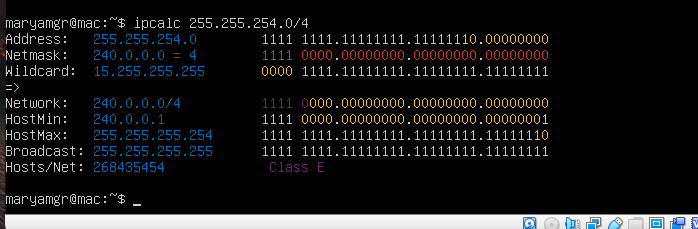

## 1.2. localhost

## Определить и записать в отчёт, можно ли обратиться к приложению, работающему на localhost, со следующими IP: 194.34.23.100, 127.0.0.2, 127.1.0.1, 128.0.0.1

С помощью команды ipcalc мы можем посмотреть айпи адреса находятся в localhost или нет
В самой последней строчке Hosts/Net пишется либо класс интернета, либо looopback, что значит айпи адрес внутренний

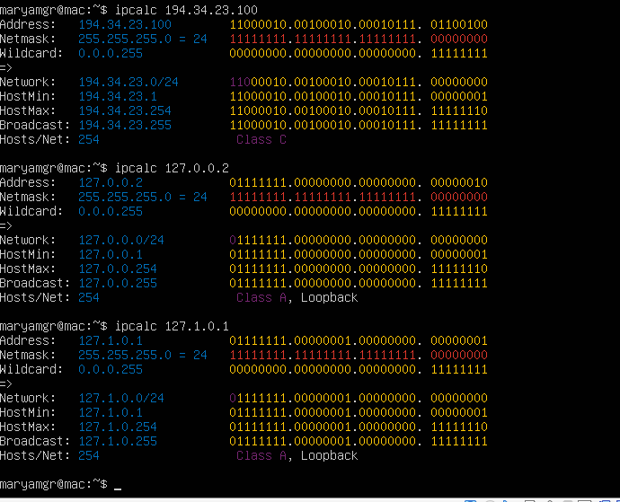

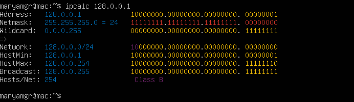

## 1.3. Диапазоны и сегменты сетей

## Определить и записать в отчёт:
## 1) какие из перечисленных IP можно использовать в качестве публичного, а какие только в качестве частных: 10.0.0.45, 134.43.0.2, 192.168.4.2, 172.20.250.4, 172.0.2.1, 192.172.0.1, 172.68.0.2, 172.16.255.255, 10.10.10.10, 192.169.168.1

Так же с помощью команды мы можем посмотреть находится ли этот айпи адрес в списке частных или публичных сетей.

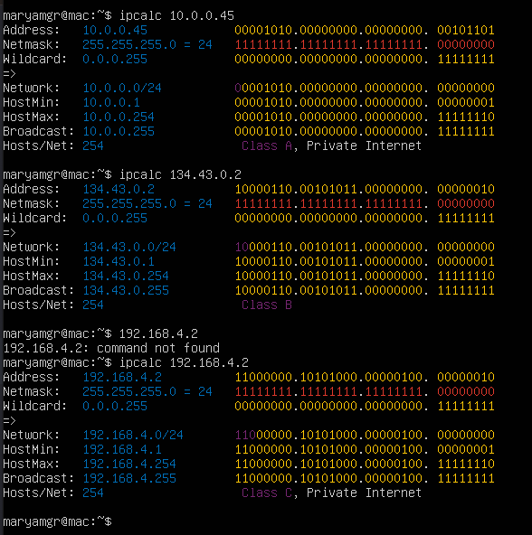

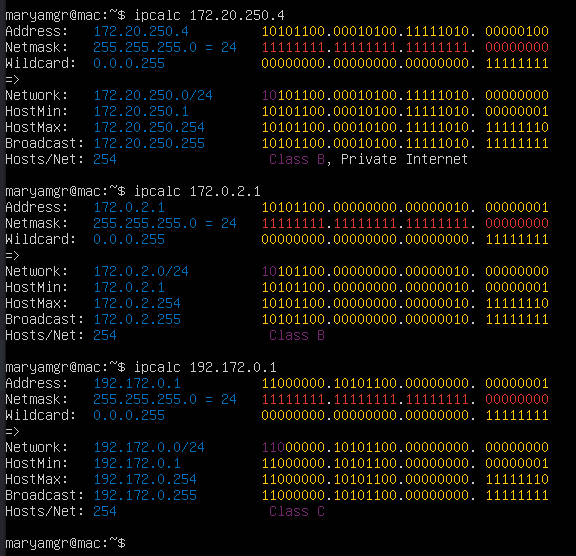

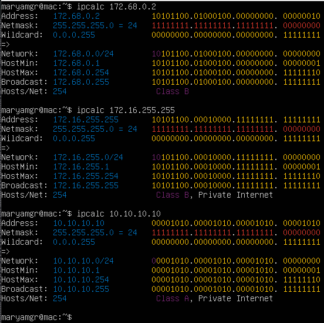

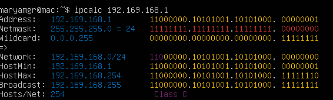

## 2) какие из перечисленных IP адресов шлюза возможны у сети 10.10.0.0/18: 10.0.0.1, 10.10.0.2, 10.10.10.10, 10.10.100.1, 10.10.1.255

Как видим на скриншоте мы можем использовать только 10.10.0.2, так как все остальные выходят за рамки.

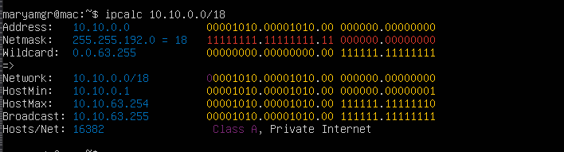

# Part 2. Статическая маршрутизация между двумя машинами

## С помощью команды ip a посмотреть существующие сетевые интерфейсы

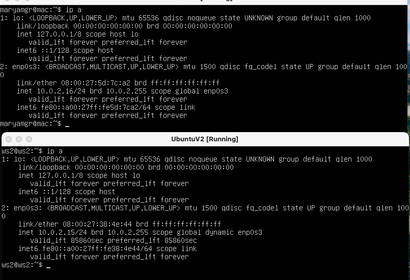

## Описать сетевой интерфейс, соответствующий внутренней сети, на обеих машинах и задать следующие адреса и маски: ws1 - 192.168.100.10, маска /16, ws2 - 172.24.116.8, маска /12

Для внутренней сети я создала новый сетевой интерфейс в самом виртуал боксе, вкладка адаптер, назвала сеть enp0s8 и выбрала соединение "внутрення сеть". 

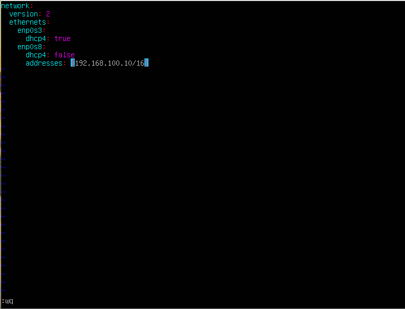

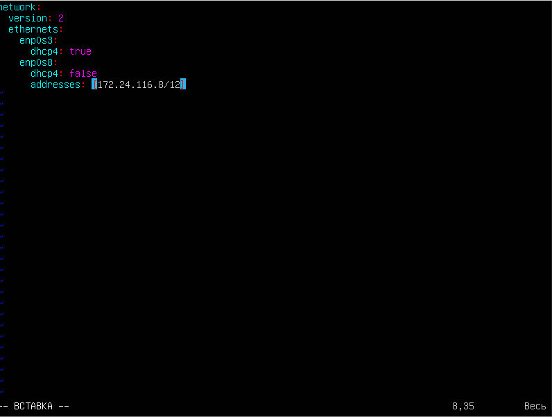

## Выполнить команду netplan apply для перезапуска сервиса сети

На первом скриншоте результат выполнения команды: netplan apply на ws1, на втором скриншоте ws2.

## 2.1. Добавление статического маршрута вручную

## Добавить статический маршрут от одной машины до другой и обратно при помощи команды вида ip r add
## Пропинговать соединение между машинами

На скриншоте показано добавление статического маршрута между двумя машинами и пинг между ними.

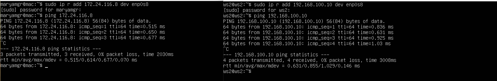

## 2.2. Добавление статического маршрута с сохранением

## Добавить статический маршрут от одной машины до другой с помощью файла etc/netplan/00-installer-config.yaml

На скриншоте показан измененный файл. Левый файл машины ws1, правый ws2.

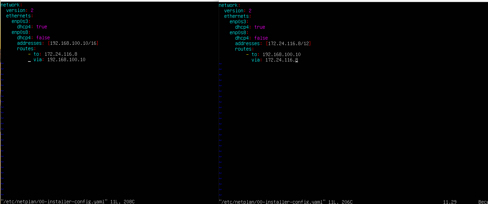

## Пропинговать соединение между машинами

На скриншоте показано применение изменений с помощью команды: netplan apply и пинг от одной машины к другой.

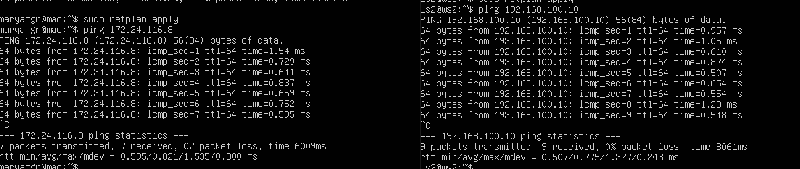

## Part 3. Утилита iperf3

## 3.1. Скорость соединения
## Перевести и записать в отчёт: 8 Mbps в MB/s, 100 MB/s в Kbps, 1 Gbps в Mbps

8 Мегабит равен 1 Мегабайт.
100 Мегабит равны 819200 килобит.
1 Гигабит равен 1024 Мегабит. 

## 3.2. Утилита iperf3
## Измерить скорость соединения между ws1 и ws2

Для начала мы должны на ws2 начать слушать сервер, а на другой машине ws1 мы должны командой iperf3 -c 172.24.116.8 узнаем скорость между двумя машинами.

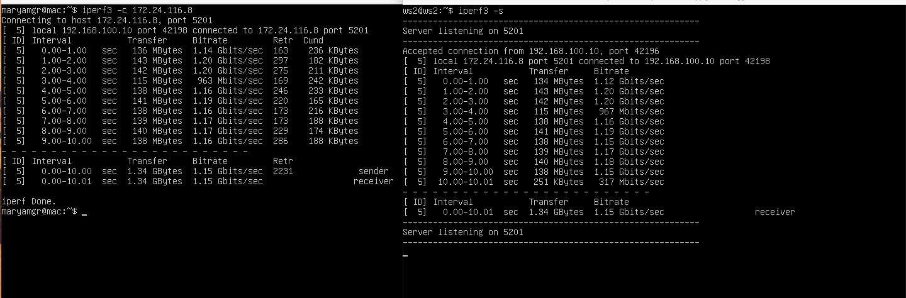

## Part 4. Сетевой экран
## 4.1. Утилита iptables

## Создать файл /etc/firewall.sh, имитирующий фаерволл, на ws1 и ws2:
## Нужно добавить в файл подряд следующие правила:
## 1) на ws1 применить стратегию когда в начале пишется запрещающее правило, а в конце пишется разрешающее правило (это касается пунктов 4 и 5)
## 2) на ws2 применить стратегию когда в начале пишется разрешающее правило, а в конце пишется запрещающее правило (это касается пунктов 4 и 5)
## 3) открыть на машинах доступ для порта 22 (ssh) и порта 80 (http)
## 4) запретить echo reply (машина не должна "пинговаться”, т.е. должна быть блокировка на OUTPUT)
## 5) разрешить echo reply (машина должна "пинговаться")
## Запустить файлы на обеих машинах командами chmod +x /etc/firewall.sh и /etc/firewall.sh

На левой стороне скриншота показан файл на ws1, на правой стороне скриншота показан файл ws2. Так же на скриншоте показана работы команды chmod +x /etc/firewall.sh

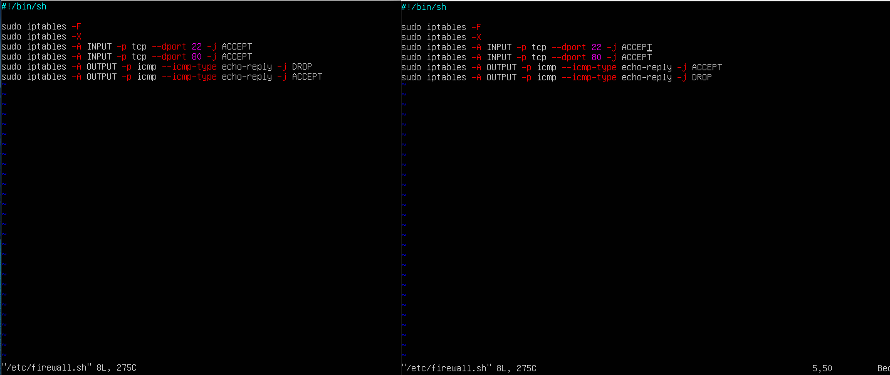

Как видно на скриншоте, сначала в обоих файлах мы открываем доступ к портам, далее в 1 файле стоит сначала запрещающее правило, а потом разрешающее. Во втором же файле сначала стоит команда, которая дает разрешающее правило, потом запрещающее. 

## 4.2. Утилита nmap
## Командой ping найти машину, которая не "пингуется", после чего утилитой nmap показать, что хост машины запущен

Запускаем команду: ping и видим, что пинг не идет с ws2 на ws1. Далее командой nmap видим, что хост машины запущен.

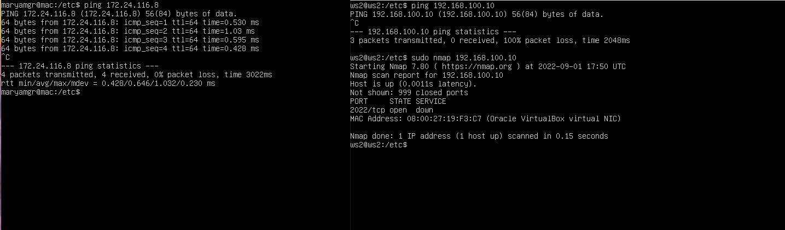

## Сохранить дампы образов виртуальных машин

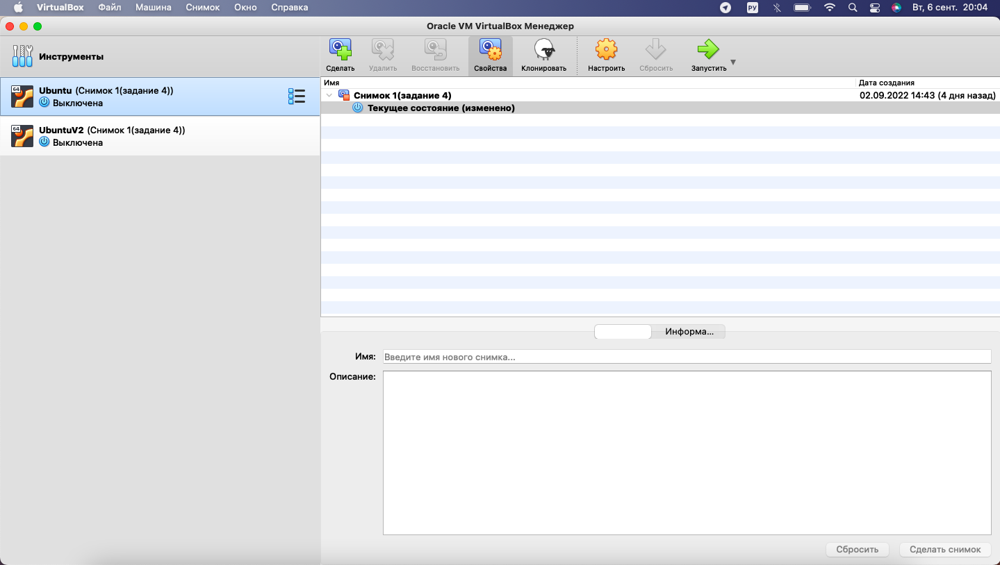

## Part 5. Статическая маршрутизация сети

## 5.1. Настройка адресов машин
## Настроить конфигурации машин в etc/netplan/00-installer-config.yaml согласно сети на рисунке.

Измененный файл для ws21:

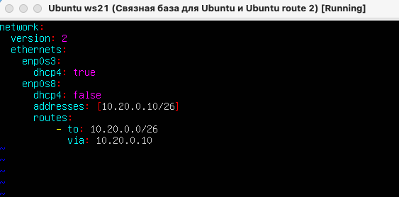

Измененный файл для ws22:

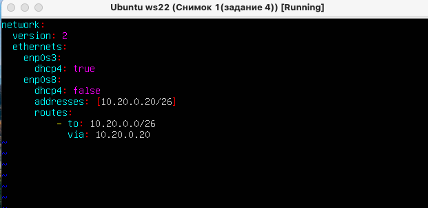

Измененный файл для ws11:

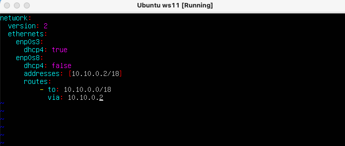

Измененный файл для router1:

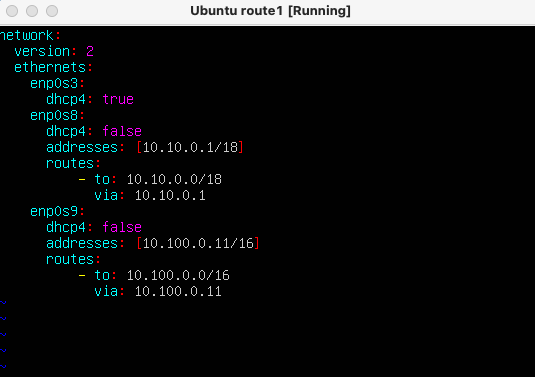

Измененный файл для router2:

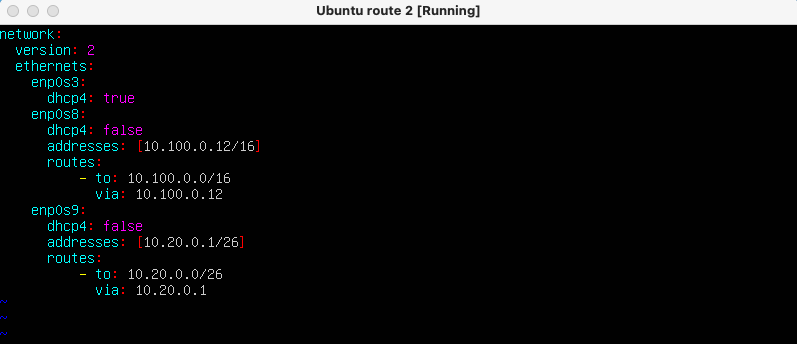

## Перезапустить сервис сети. Если ошибок нет, то командой ip -4 a проверить, что адрес машины задан верно. Также пропинговать ws22 с ws21. Аналогично пропинговать r1 с ws11.

Командой netplan appy перезапускаем сервис сети и проверяем, что адреса машин заданы верно.

ws21:

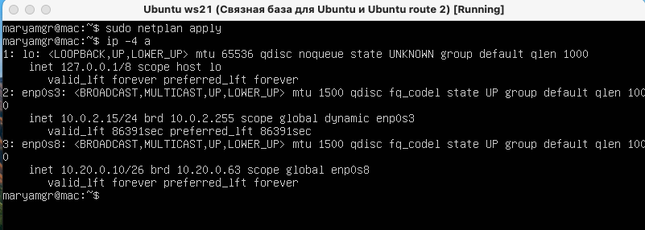

ws22:

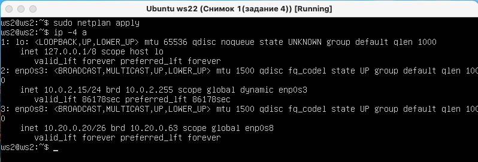

ws11:

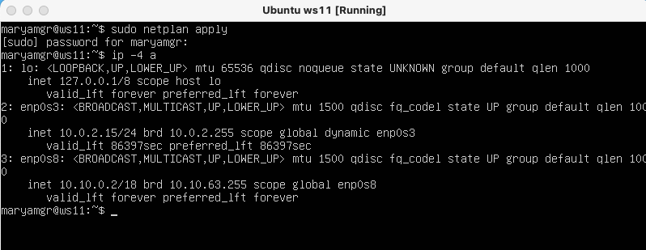

router1:

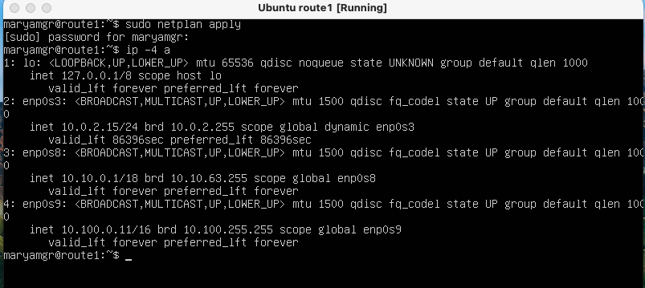

router2:

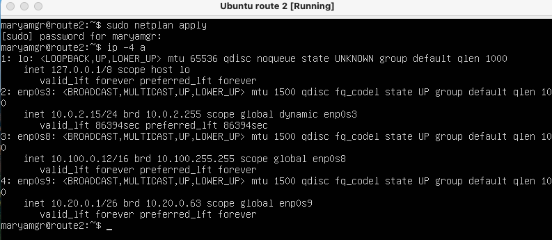

Пинг ws22 c ws21:

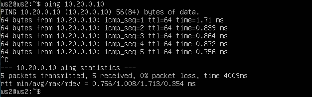

Пинг router1 c ws11:

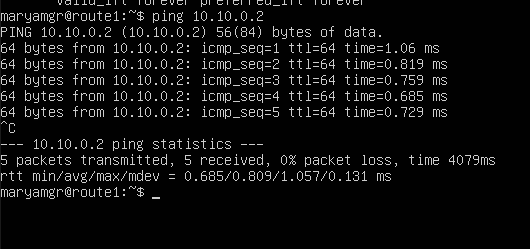

## 5.2. Включение переадресации IP-адресов.
## Для включения переадресации IP, выполните команду на роутерах:

На скрине показана комана и ее вывод.

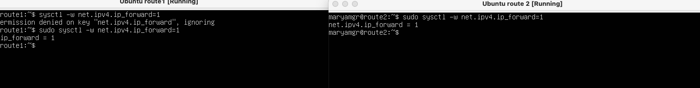

## Откройте файл /etc/sysctl.conf и добавьте в него следующую строку:

Измененный файл на route1:

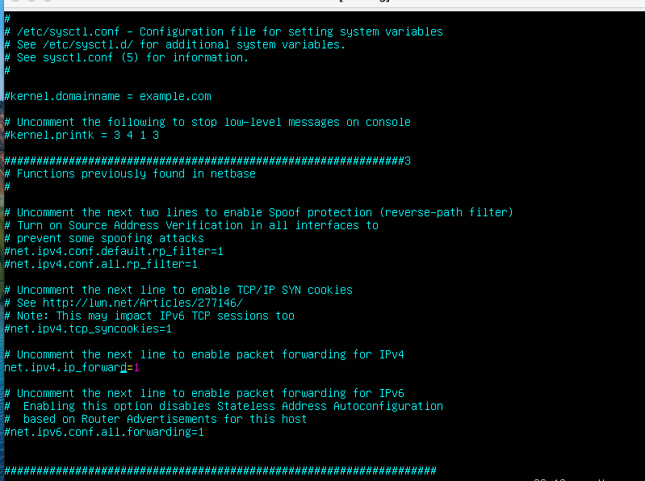

Измененный файл на route2:

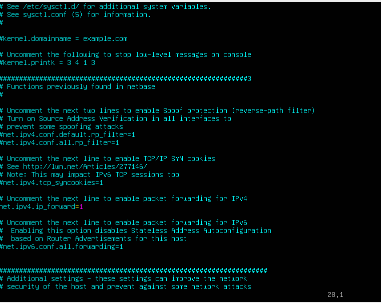

## 5.3. Установка маршрута по-умолчанию

## Настроить маршрут по-умолчанию (шлюз) для рабочих станций. Для этого добавить default перед IP роутера в файле конфигураций

Измененный файл для ws21:

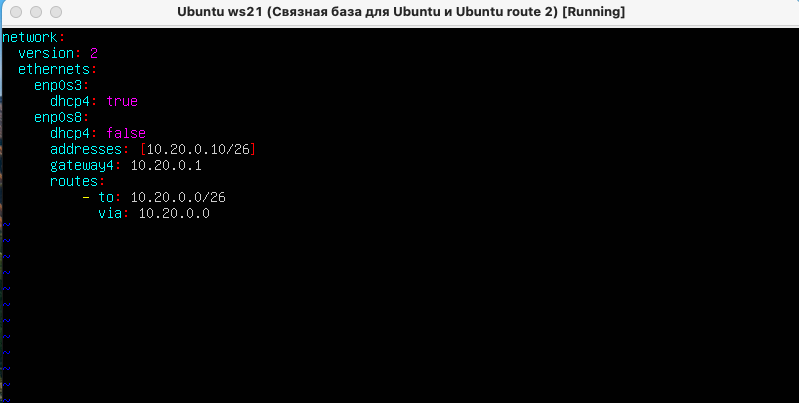

Измененный файл для ws22:

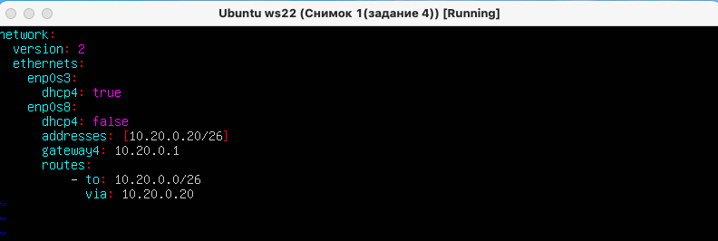

Измененный файл для ws11:

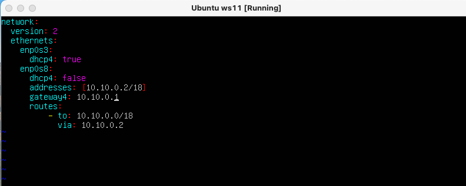

## Вызвать ip r и показать, что добавился маршрут в таблицу маршрутизации

Команда: ip r для ws21:

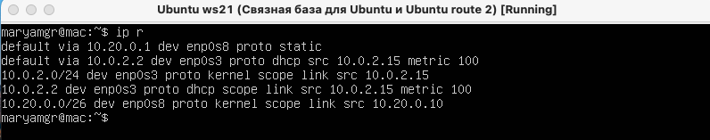

Команда: ip r для ws22:

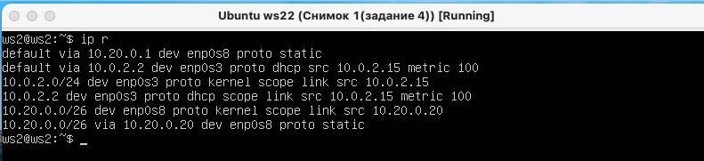

Команда: ip r для ws11:

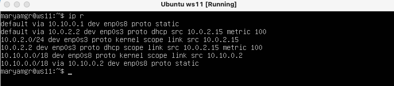

## Пропинговать с ws11 роутер r2 и показать на r2, что пинг доходит. Для этого использовать команду:

tcpdump -tn -i eth1

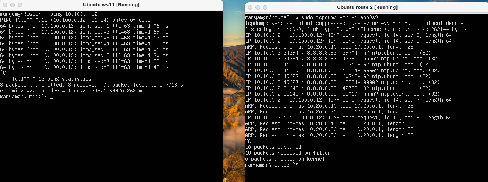

## 5.4. Добавление статических маршрутов
## Добавить в роутеры r1 и r2 статические маршруты в файле конфигураций.

Измененный файл на route1:

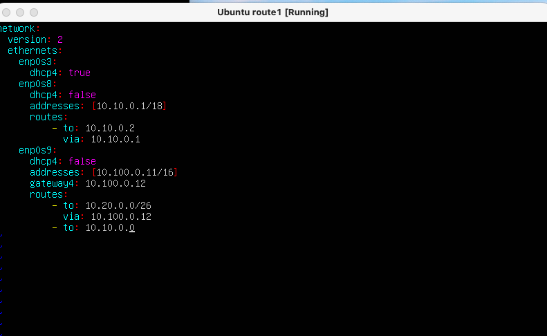

Измененный файл на route2:

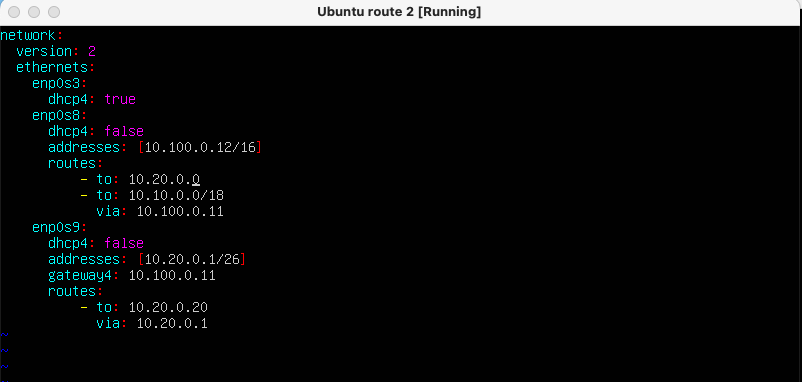

## Вызвать ip r и показать таблицы с маршрутами на обоих роутерах.

Вызываем команду: ip r на обоих роутерах:

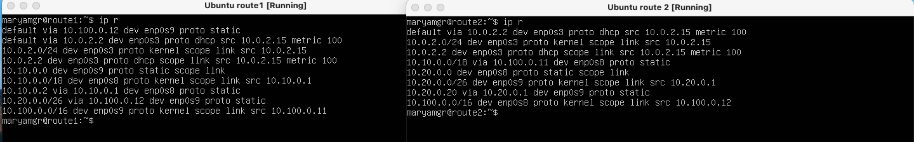

## Запустить команды на ws11:

ip r list 10.10.0.0/[маска сети] и ip r list 0.0.0.0/0

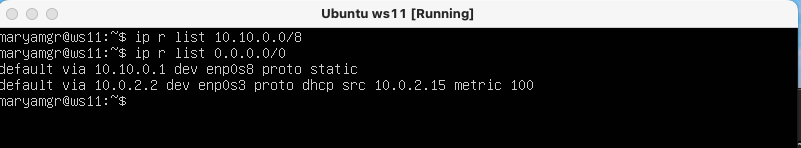

Для второго айпи был выбран другой маршрут, так как маршрутизатор выбирает маршрут с самой длинной маской, так как это является более точным решением. Поэтому маршрут по умолчанию никогда не будет выбран, если есть альтернативные варианты.

## 5.6. Использование протокола ICMP при маршрутизации

## Запустить на r1 перехват сетевого трафика, проходящего через eth0 с помощью команды: tcpdump -n -i eth0 icmp
## Пропинговать с ws11 несуществующий IP (например, 10.30.0.111) с помощью команды: ping -c 1 10.30.0.111

На скриншоте показано выполнения команд, которые указаны в задании

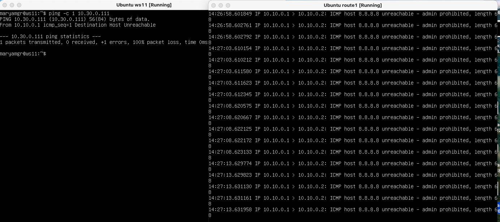

## Сохранить дампы образов виртуальных машин

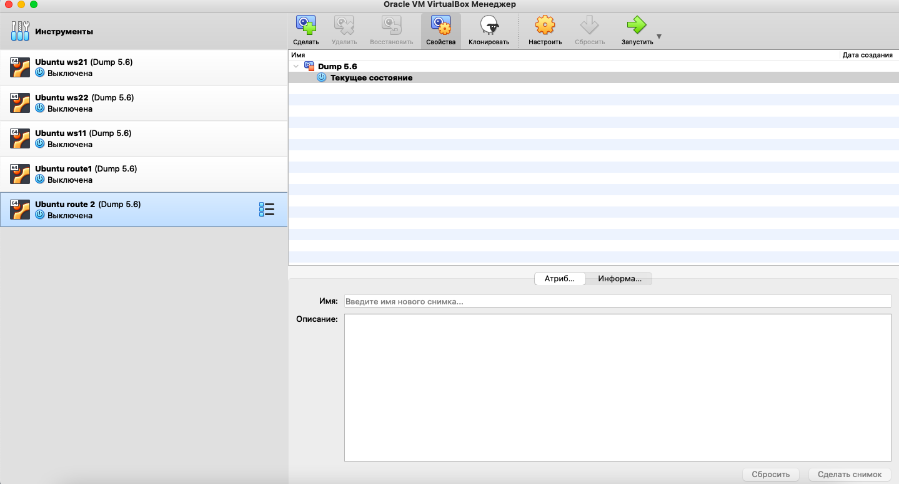

## Part 6. Динамическая настройка IP с помощью DHCP

## Для r2 настроить в файле /etc/dhcp/dhcpd.conf конфигурацию службы DHCP:
## 1) указать адрес маршрутизатора по-умолчанию, DNS-сервер и адрес внутренней сети.

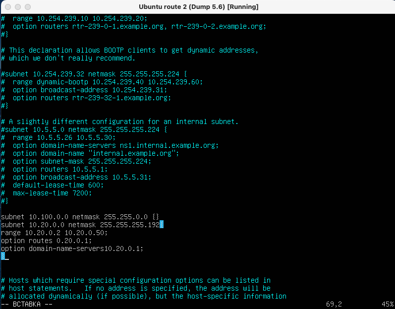

## 2) в файле resolv.conf прописать nameserver 8.8.8.8.

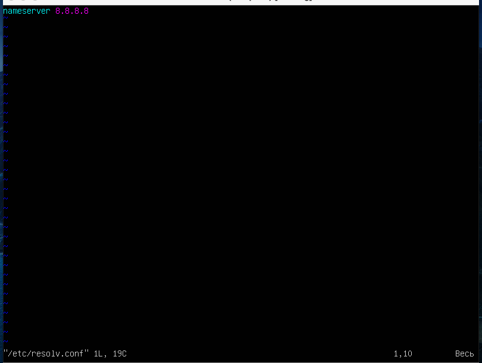

## Перезагрузить службу DHCP командой systemctl restart isc-dhcp-server. Машину ws21 перезагрузить при помощи reboot и через ip a показать, что она получила адрес. Также пропинговать ws22 с ws21.

1. Перезагрузить службу DHCP:

2. Рестарт машины ws21:

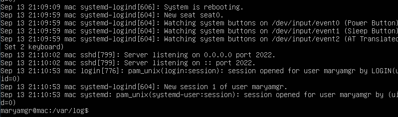

3. Команда ip a:

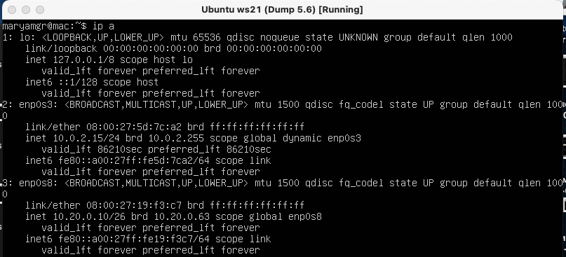

4. С помощью команды пингуем машины ws22 с ws21:

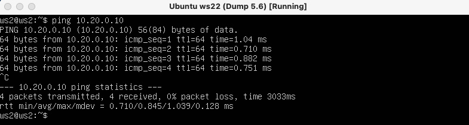

## Указать MAC адрес у ws11, для этого в etc/netplan/00-installer-config.yaml надо добавить строки: macaddress: 10:10:10:10:10:BA, dhcp4: true

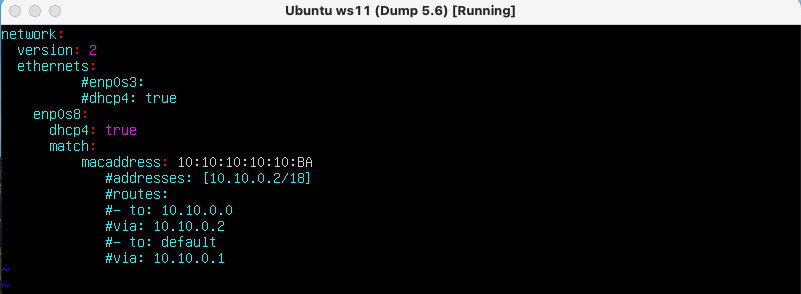

## Для r1 настроить аналогично r2, но сделать выдачу адресов с жесткой привязкой к MAC-адресу (ws11). Провести аналогичные тесты

Измененный конфиг на роутере 1:

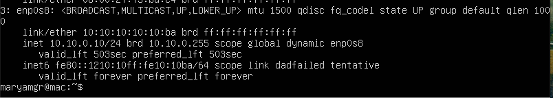

 IP на ws21: 

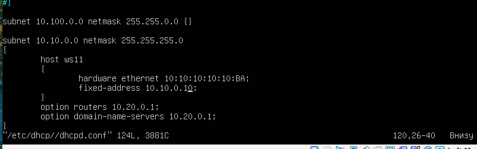

## Запросить с ws21 обновление ip адреса

Сначала нам нужно освободить аренду, то есть свободить айпи адрес, который мы используем. Для этого нам нужна команда: sudo dhclient -r(если для кокнкретного интерфейса, то прописываем его в конце).
Дальше мы обновляем айпи адрес командой: sudo dhclient(если для кокнкретного интерфейса, то прописываем его в конце).

Айпи адрес до обновления: 

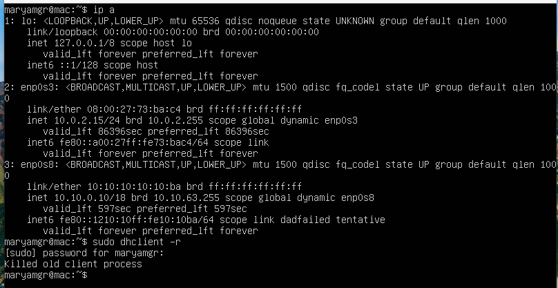

Айпи адрес после обновления: 

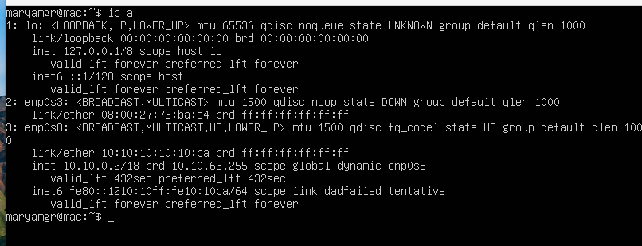

## Сохранить дампы образов виртуальных машин

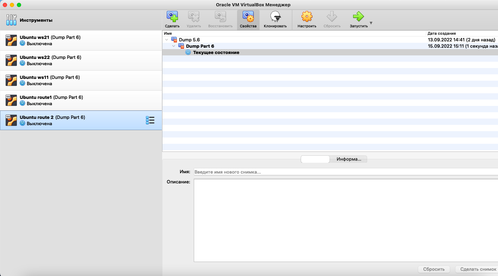

## Part 7. NAT

## В файле /etc/apache2/ports.conf на ws22 и r1 изменить строку Listen 80 на Listen 0.0.0.0:80, то есть сделать сервер Apache2 общедоступным

Файл на машине ws22: 

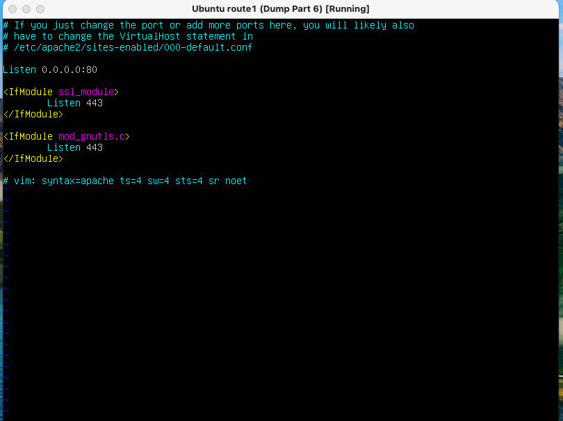

Файл на r1:

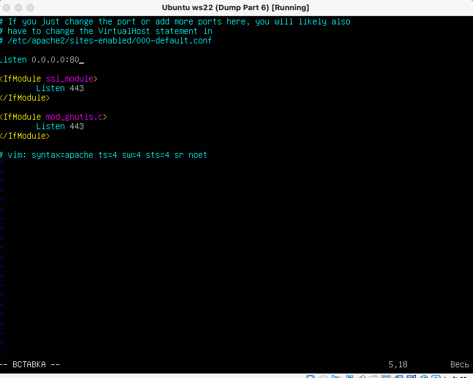

## Запустить веб-сервер Apache командой service apache2 start на ws22 и r1

На скриншоте  показан запуск сервера с r1: 

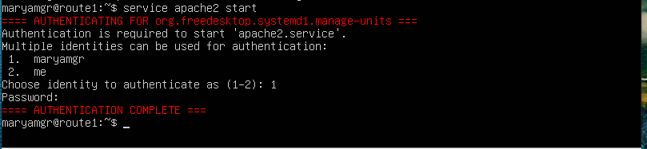

На скриншоте  показан запуск сервера с ws22: 

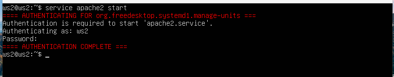

## Добавить в фаервол, созданный по аналогии с фаерволом из Части 4, на r2 следующие правила:

## 1) Удаление правил в таблице filter - iptables -F
## 2) Удаление правил в таблице "NAT" - iptables -F -t nat
## 3) Отбрасывать все маршрутизируемые пакеты - iptables --policy FORWARD DROP

## Запускать файл также, как в Части 4

### Проверить соединение между ws22 и r1 командой ping(пинг идти не должен)

## 4) Разрешить маршрутизацию всех пакетов протокола ICMP

### Проверить соединение между ws22 и r1 командой ping(пинг должен идти)

Фаервоол на роутере 2:

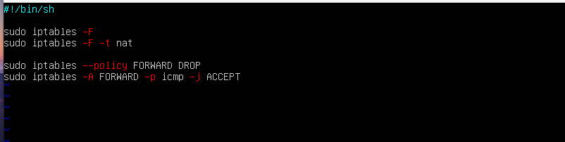

Пинг: 

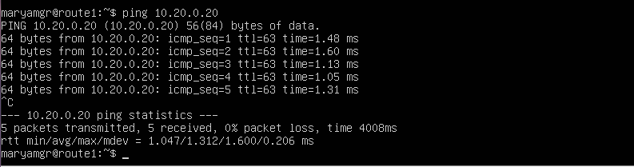

## 5) Включить SNAT, а именно маскирование всех локальных ip из локальной сети, находящейся за r2 (по обозначениям из Части 5 - сеть 10.20.0.0)

## 6) Включить DNAT на 8080 порт машины r2 и добавить к веб-серверу Apache, запущенному на ws22, доступ извне сети

Фаервоол на роутере 2:

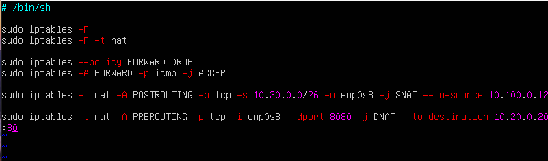

Telnet: 

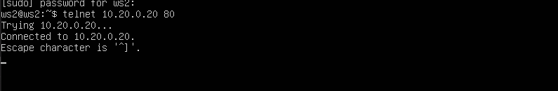